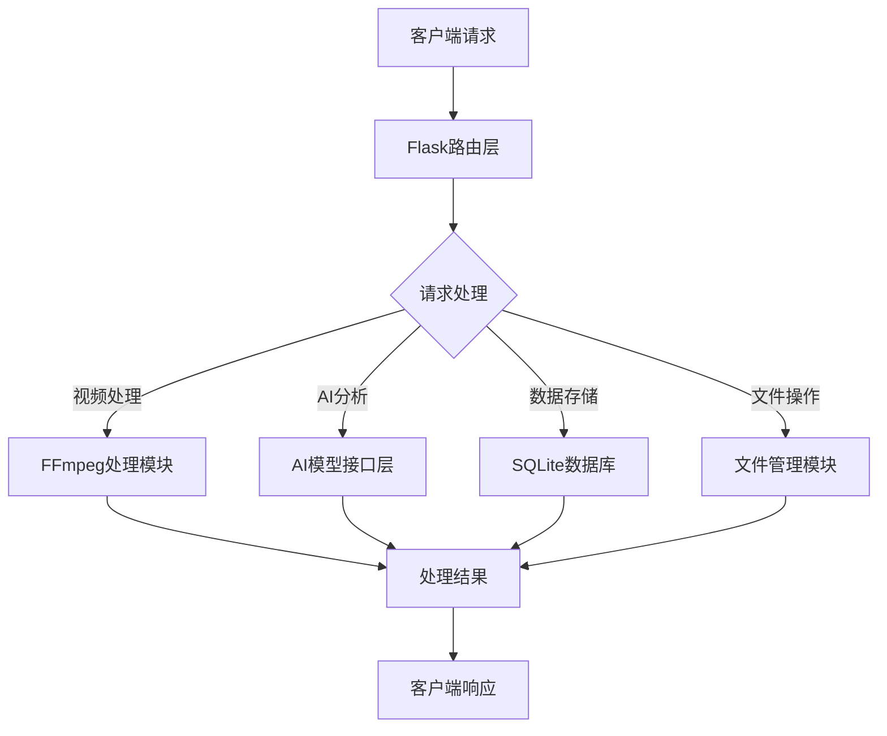
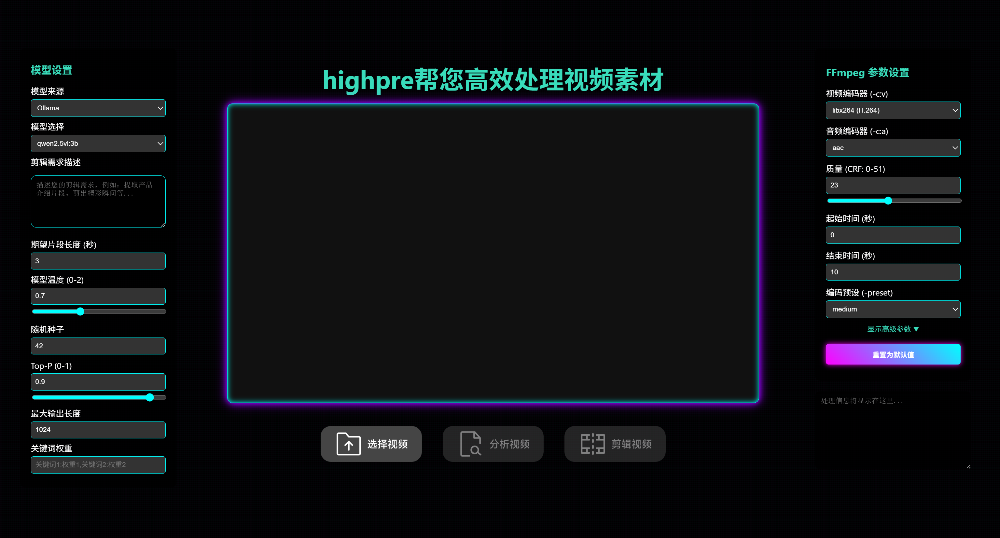
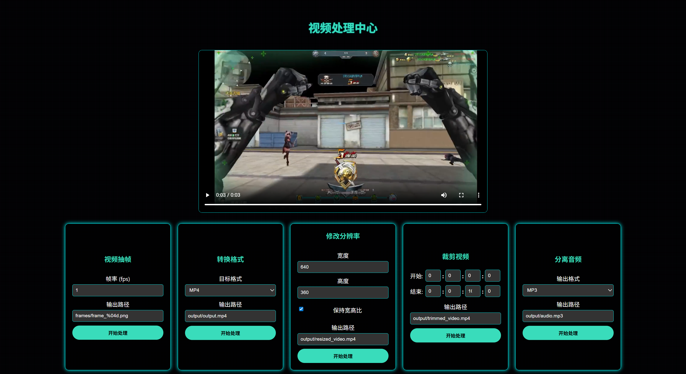
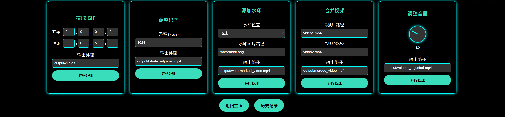
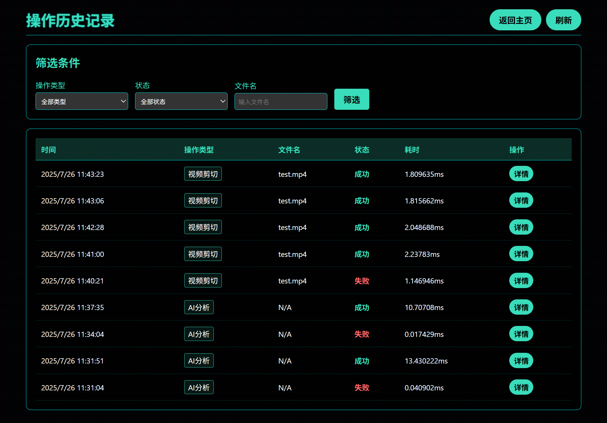
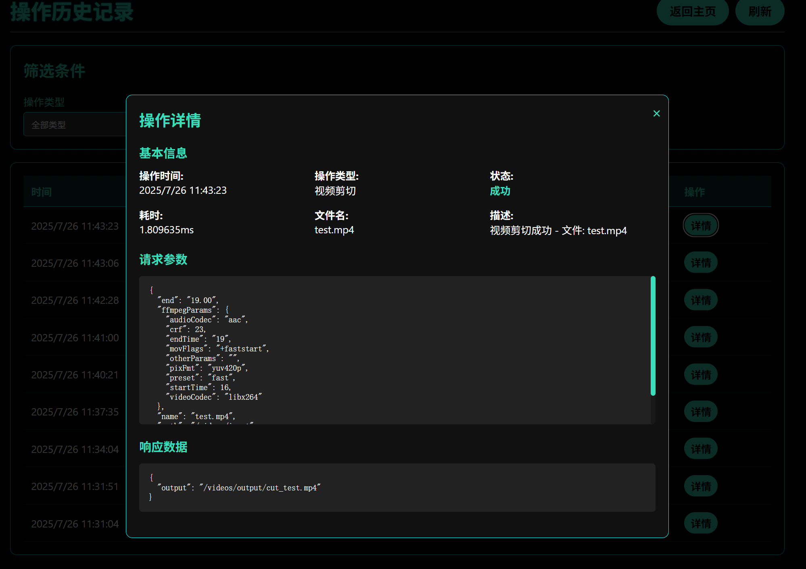

# HighPre - 高性能Web应用框架

[](https://www.python.org/downloads/)
[](LICENSE)
[](https://github.com/Sempre0721/highpre/actions)
> 本项目是一个基于视觉理解和flask框架的Web应用，旨在提高日常剪辑效率，实现自动化处理视频素材。

## 项目简介

HighPre是一个基于计算机视觉理解和Flask框架构建的智能化视频处理工具，专注于提升视频剪辑工作的自动化水平。本项目利用先进的视觉识别技术，能够自动分析和理解视频素材，显著减少人工剪辑时间，提高内容创作效率。

本项目采用Python生态系统构建，结合Flask框架提供稳定可靠的Web服务，同时可在发行里找到windows应用。HighPre支持多种参数调整，为内容创作者、视频编辑师和自媒体从业者提供一站式自动化视频处理解决方案。

## 快速开始

### 环境要求
- Python 3.11
- pip包管理器
- FFmpeg(https://ffmpeg.org/download.html)

### 安装部署

```bash
# 克隆项目仓库
git clone https://github.com/Sempre0721/highpre.git
cd highpre

# 启动项目 运行项目根目录下的启动脚本:
- venv-start.bat - 使用虚拟环境
- start.bat - 不使用虚拟环境

# 如有依赖缺失，请手动安装依赖包
pip3 install -r requirements.txt
```

## 整体架构


```txt
highpre/
├── main.py                 # 应用入口文件
├── requirements.txt        # 项目依赖列表
├── start.bat               # Windows启动脚本
├── README.md               # 项目说明文档
├── history.db              # 历史记录数据库
├── config.json             # 核心配置文件
├── .gitignore              # Git忽略文件配置
├── static/                 # 静态资源目录
│   ├── fonts/              # 字体文件
│   ├── images/             # 图片资源
│   └── favicon.svg         # 网站图标
├── videos/                 # 视频文件目录
│   ├── input/              # 输入视频
│   └── output/             # 输出视频
└── templates/              # 模板文件目录
    ├── history.html        # 历史记录页面
    ├── index.html          # 主页&视频处理页
    └── result.html         # 剪辑完成后显示结果页面，提供下一步
```
# 遥遥领先
### 🚀 效率至上
与市面上大多数AI视频处理工具不同，highpre采用本地FFmpeg进行视频处理，而非重新生成视频。这种方法极大地提升了处理效率，避免了AI生成的耗时过程，让视频剪辑、格式转换、分辨率调整等操作在秒级完成。本地处理也意味着更好的隐私保护，用户的视频文件无需上传到第三方服务器。

### 📈 性能瓶颈突破
* 框架采用异步处理机制处理视频等耗时操作，避免阻塞主线程。
* 通过调用本地Ollama模型和集成腾讯云、讯飞星火、kimi、魔搭社区等云端AI服务，实现了本地和云端资源的合理分配利用，提升系统整体处理能力。

### 🎨 赛博风格界面
* 赛博朋克视觉设计：界面采用深色主题配合霓虹色彩，营造出典型的赛博朋克风格
* 现代化UI布局：直观的用户界面设计，便于操作视频处理功能
* 响应式交互体验：从启动界面到处理完成的全流程可视化反馈
🖼️ 界面展示
### 🔧 维护成本降低
项目采用模块化设计，将视频处理、AI分析、数据库操作等功能分离到不同模块中。清晰的代码结构和详细的注释显著降低了后期维护和迭代的成本。

### 🔄 技术栈统一
highpre提供了一套完整的视频处理解决方案，从前端界面到后端处理，从本地AI模型到云端API调用，统一使用Python技术栈，避免了技术栈混乱的问题。

# 项目演示
## 启动界面
应用启动后将在本地提供服务，控制台将显示如下信息：

```bash
Installing dependencies from requirements.txt...
Looking in indexes: https://pypi.tuna.tsinghua.edu.cn/simple
Requirement already satisfied: Flask==3.0.3
Requirement already satisfied: requests==2.31.0
Requirement already satisfied: ollama==0.5.1
Requirement already satisfied: openai==1.66.2
Requirement already satisfied: tencentcloud-sdk-python==3.0.1430

Checking FFmpeg availability...
✓ FFmpeg found: .\ffmpeg.EXE
FFmpeg check passed, continuing to start application...

Starting the application...
 * Serving Flask app 'main'
 * Debug mode: on
 * Running on http://127.0.0.1:5839
 * Debugger PIN: 488-043-258

INFO:werkzeug:127.0.0.1 - - [26/Jul/2025 11:20:46] "GET / HTTP/1.1" 200 -
```








# 贡献指南
欢迎提交Issue和Pull Request来帮助改进highpre框架。在贡献代码前，请确保：

* 遵循项目代码规范
* 编写相应的测试用例
* 更新相关文档
* 完成自动化测试
## 许可证
本项目采用MIT许可证，详情请参见LICENSE文件。

<p align="center"> Made with ❤️ by <a href="https://github.com/Sempre0721">sempre</a> <a href="https://github.com/LaoSiBai">laosibai</a></p>